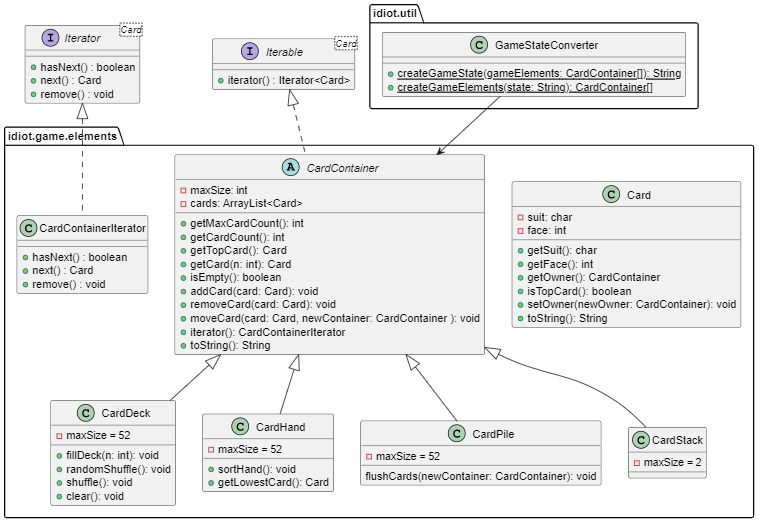

# IdiotCardGame

This project is a simple implementation of the card game "idiot" made using JavaFX. The following documentation will include a description of the game itself, a class diagram for one of the more interesting parts of the code, an overview of the object oriented principles used, and a discussion regarding the approach to testing the code.

## The Game

Players start with three stacks of cards, and the goal is to get rid of all your cards. Players need at least three cards in their hand. Cards are played on the main pile if their face value is equal to or higher than the top card, with some exceptions. Values of 2 or 10 can always be played, and if a player has a card with the same face value as the one just played, they can also play that card. Four cards of the same face value burn the pile. The game continues until one player has gotten rid of all their cards.

The code implementation takes this game into a JavaFX GUI environment, where a player can play against a simple AI. After pressing "start" on the game page, available actions appear as buttons with labels "play", "draw pile" and "end turn". When a winner is crowned, the player is prompted to save a replay file of the game. From the main menu, the player can then choose to "Watch Replay", where any replay file in the replay resource folder can be played back. Simple controls like "go forward", "go backwards" and "go to end" are here provided in order to to navigate through the replay file. The specifics of the implementation is discussed more closely in the [README](README.md) file, but this sums up the user experience from the GUI point of view.

## Diagram

The image presented below shows the class diagram of the **GameStateConverter** utility class, and its connection to the **CardContainer** class.

## Relevant Object-Oriented Principles

Most of the classes in this project use known object-oriented principles to a large extent. A good example is the **CardContainer** class, which in addition to being an abstract parent to several subclasses also forms an 1-n association between itself and the contained **Card** objects. The **Card** and **CardContainer** classes both implement interfaces, as mentioned previously. Many of the main classes also use the principle of delegation through the help of utility classes. All classes except the ones with a mostly static structure are fully encapsulated, and exceptions are thrown when appropriate. The only technique that could have been better utilized is the observer-observable relationship; even though the **CardPane** objects are moved in tandem with their **Card** object counterparts, this could have been executed more robustly through the use of required interface methods.

### The Model-View-Controller Principle

Since this is a JavaFX project, it is important to discuss the dynamics within the GUI's connection to the underlying model. As discussed in the code specific section, the classes can be split into layers, where the top layer is more concerned with controlling the GUI, and the lower level classes control the game logic. In the context of the Model-Controller relationship, this this separation is a good thing. The job of a controller should be to bridge the gap between the higher level GUI and lower level logic, and since both the main controllers **GameController** and **ReplayController** communicate with both the GUI and game logic, this requirement is fulfilled. The GUIs defined in the FXML files are mostly unchanged at runtime, with some label changes and game state changes being exceptions. Thus the Model-View relationship is separated in a way that is satisfiable. All together, this leads to an application that follows the Mode-View-Controller principle decently well.

## Testing

The approach to testing for this project was largely rooted in actual play testing. Since most of the game state testing was more easily done by simply running the app, making JUnit tests for this part of the app proved inefficient. The core classes were still unit tested, and the focus on handling exceptions was most important for this part of the code. For the **Game**, **Player** and **Replay** classes however, testing with JUnit was not as important. The most interesting test is found for the utility class **GameStateConverter**, which is the class depicted in the class diagram above. Here, the format of the game state could be tested in isolation, making it useful when designing each respective conversion method. Testing the **FileHelper** proved difficult, as some configurations with the writing permissions from the test directory did not work as anticipated. However, the file management could be tested directly through the application's replay feature, confirming that it worked as expected.