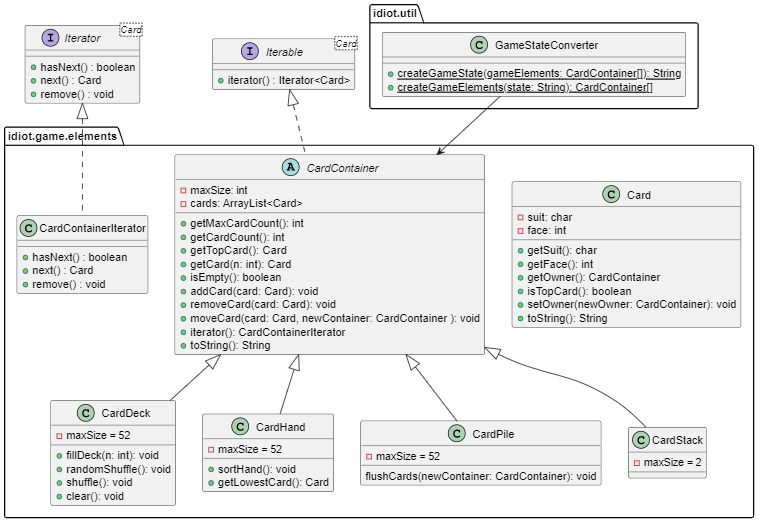

# Code Overview

## The Code

### First Layer: Core Components

The game's code is structured around several classes that interact with each other. The core components are here the **Card** and **CardContainer** classes, where each **CardContainer** is an abstract class which can store **Card** objects up to a set maximum amount. The **CardContainer** class includes ways for moving **Card** objects across containers with the "addCard", "removeCard" and "moveCard" methods. Other methods, such as "getTopCard" and the boolean "isEmpty", are also included to get information about the **ArrayList** that is stored inside. **Card** objects are themselves constructed with a suit (_char_) and face (_int_), both of which can be returned with appropriate getter methods. Each **Card** also has a field containing its "owner", which is the given **CardContainer** it belongs to. 

Both **Card** and **CardContainer** implement their own interfaces in the form of a comparator and an iterator respectively. The **CardComparator** class contains a **HashMap** mapping from _char_ to _int_, keeping track of priority values for how a given **Card**'s suit compares to that of another **Card** object. The required "compare" method also takes into account the face values, ranking the ace highest. The **CardContainerIterator** class provides a way to loop through the inner **ArrayList** of **Card** objects with for-each loops on the **CardContainer** class directly.

Specific types of containers come in the form of **CardDeck**, **CardPile**, **CardHand** and **CardStack** objects, all of which as subclasses of **CardContainer**. A **CardDeck** can be filled using the "fillDeck" method, a **CardPile** can move all its cards using the "flushCards" method, a **CardHand** can be sorted using the "sortHand" method, and a **CardStack** initialized with a max card count of 2.

### Second Layer: Game Components

The second layer of classes consists of **Game**, **Player** and **Replay**. The **Game** class keeps track of an **Array** of **CardContainer** instances, where the state of the game is given by the distribution of **Card** objects across these containers. Each **Game** also contains two **Player** objects, which represent the agents participating in the game. The **Player** class contains all of the game logic described earlier, accessible through the "isLegalMove" and "getLegalMoves" methods. Interaction with the game is done through the "playCard", "drawFromPile" and "endTurn" methods. The **AIPlayer** class is a subclass of **Player** which automatically completes moves with simple AI logic until its turn is completed.

The **Game**'s connection to the **Replay** class is one of the more interesting parts of the project. Found within the **Game** class is the "recordGameState" method, which is responsible for saving a given game state in **String** format, and adding them to an **ArrayList**. When a game is finished, the list of recorded states is then saved to a file through the "saveReplay" method. The **Replay** class takes the path of a given file as an argument in its constructor, loads in the states from it, and converts it back to **CardContainer** instances. This allows for a visual playback of the game, using the "goForward", "goBackward", "goToStart" and "goToEnd" methods to navigate between game states.

### Third Layer: Utility Classes

The conversion between **CardContainer** instances and single **String** objects is made possible by a utility class called **GameStateConverter**, which uses static methods to process input and return an output. A class diagram for the **GameStateConverter** class is shown below, with the **CardContainer** taking center stage. In a similar fashion, the **FileHelper** class allows for writing to files with the "writeLines" method, and reading from files with the "readLines" method.

Another utility class is the **GuiHelper**, which is responsible for updating the graphical user interface based on the state of given **CardContainer** objects. The **GuiHelper** class also has a static field "SELECTED_CARD" which contains the **Card** object that is currently selected in the GUI.

### Fourth Layer: Controllers

There are a total of 5 FXML files in the project, and each file has a corresponding controller. The **CardPane** controller is a subclass of **Pane**, and contains code for representing a given **Card** object in the GUI. Analogous to how **Card** objects are stored in **CardContainers**, the **CardPane** objects are stored inside **StackPane** and **HBox** objects. The **GameController** and **ReplayController** classes both include 52 **CardPane** objects through the "initializeGui" method in the **GuiHelper** class, and also possess several **Button** objects that are related to in-game actions. The **MainMenuController** class creates a way to navigate between the game- and replay pages, and contains an exit button to get out of the app.

## Relevant Object-Oriented Principles

Most of the classes in this project use known object-oriented principles to a large extent. A good example is the **CardContainer** class, which in addition to being an abstract parent to several subclasses also forms an 1-n association between itself and the contained **Card** objects. The **Card** and **CardContainer** classes both implement interfaces, as mentioned previously. Many of the main classes also use the principle of delegation through the help of utility classes. All classes except the ones with a mostly static structure are fully encapsulated, and exceptions are thrown when appropriate. The only technique that could have been better utilized is the observer-observable relationship; even though the **CardPane** objects are moved in tandem with their **Card** object counterparts, this could have been executed more robustly through the use of required interface methods.

### The Model-View-Controller Principle

Since this is a JavaFX project, it is important to discuss the dynamics within the GUI's connection to the underlying model. As discussed in the code specific section, the classes can be split into layers, where the top layer is more concerned with controlling the GUI, and the lower level classes control the game logic. In the context of the Model-Controller relationship, this this separation is a good thing. The job of a controller should be to bridge the gap between the higher level GUI and lower level logic, and since both the main controllers **GameController** and **ReplayController** communicate with both the GUI and game logic, this requirement is fulfilled. The GUIs defined in the FXML files are mostly unchanged at runtime, with some label changes and game state changes being exceptions. Thus the Model-View relationship is separated in a way that is satisfiable. All together, this leads to an application that follows the Mode-View-Controller principle decently well.

## Testing

The approach to testing for this project was largely rooted in actual play testing. Since most of the game state testing was more easily done by simply running the app, making JUnit tests for this part of the app proved inefficient. The core classes were still unit tested, and the focus on handling exceptions was most important for this part of the code. For the **Game**, **Player** and **Replay** classes however, testing with JUnit was not as important. The most interesting test is found for the utility class **GameStateConverter**, which is the class depicted in the class diagram above. Here, the format of the game state could be tested in isolation, making it useful when designing each respective conversion method. Testing the **FileHelper** proved difficult, as some configurations with the writing permissions from the test directory did not work as anticipated. However, the file management could be tested directly through the application's replay feature, confirming that it worked as expected.
